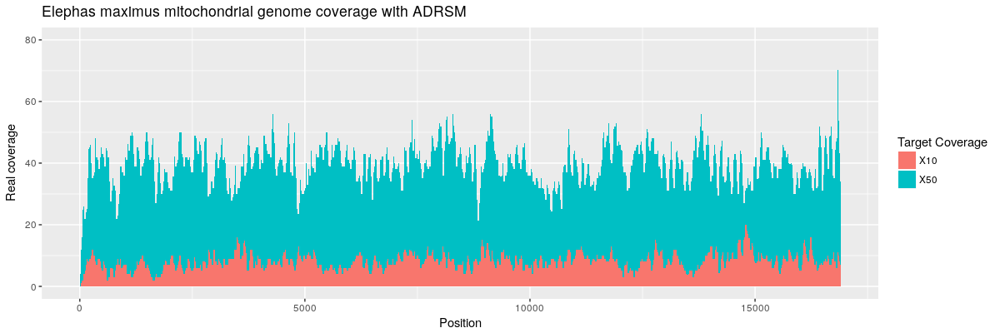
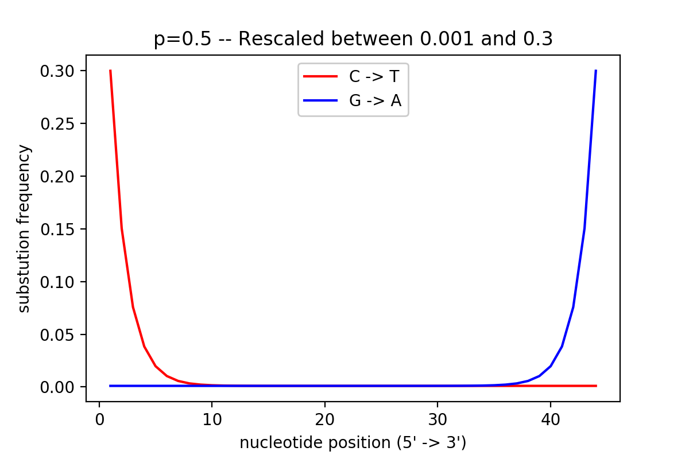
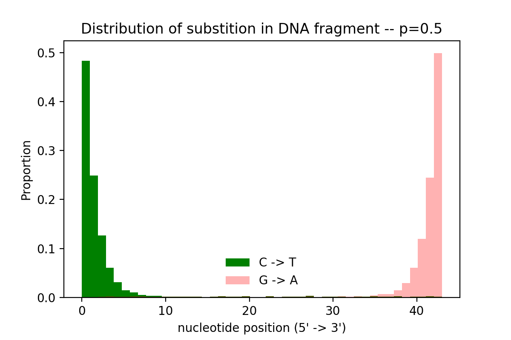

     

* * *

# Introduction

ADRSM (Ancient DNA Read Simulator for Metagenomics) is a tool designed to simulate the paired-end sequencing of a metagenomic community. ADRSM allows you to control precisely the amount of DNA from each organism in the community, which can be used, for example, to benchmark different metagenomics methods.

# Requirements

-   [Conda](https://conda.io/miniconda.html)  

# Installation

    conda install -c maxibor adrsm

# Usage

    adrsm ./data/short_genome_list.csv

# Output

-   `metagenome.{1,2}.fastq` : Simulated paired end reads
-   `stats.csv` : Statistics of simulated metagenome (organism, percentage of organism's DNA in metagenome)

# Cite

You can cite ADRSM like this:

    Maxime Borry (2018). ADRSM: Ancient DNA Read Simulator for Metagenomics. DOI: 10.5281/zenodo.1462743

# Help

    $ adrsm --help
    Usage: adrsm [OPTIONS] CONFFILE

      ==================================================
      ADRSM: Ancient DNA Read Simulator for Metagenomics
      Author: Maxime Borry
      Contact: <borry[at]shh.mpg.de>
      Homepage & Documentation: github.com/maxibor/adrsm

      CONFFILE: path to ADRSM configuration file

    Options:
      --version                    Show the version and exit.
      -r, --readLength INTEGER     Average read length  [default: 76]
      -n, --nbinom INTEGER         n parameter for Negative Binomial insert length
                                   distribution  [default: 8]

      -fwd, --fwdAdapt TEXT        Forward adaptor sequence  [default: AGATCGGAAGA
                                   GCACACGTCTGAACTCCAGTCACNNNNNNATCTCGTATGCCGTCTTC
                                   TGCTTG]

      -rev, --revAdapt TEXT        Reverse adaptor sequence  [default: AGATCGGAAGA
                                   GCGTCGTGTAGGGAAAGAGTGTAGATCTCGGTGGTCGCCGTATCATT
                                   ]

      -p, --geom_p FLOAT RANGE     Geometric distribution parameter for
                                   deamination  [default: 0.5]

      -m, --minD FLOAT RANGE       Deamination substitution base frequency
                                   [default: 0.01]

      -M, --maxD FLOAT RANGE       Deamination substitution max frequency
                                   [default: 0.3]

      -e, --effort INTEGER         Sequencing effort, maximum number of output reads to
                                   be sampled from pool [default: 100]

      -s, --seed INTEGER           Seed for random generator generator  [default:
                                   42]

      -t, --threads INTEGER RANGE  Number of threads for parallel processing
                                   [default: 2]

      -o, --output PATH            Fastq output file basename  [default:
                                   ./metagenome]

      -s, --stats PATH             Summary statistics file  [default: ./stats.csv]
      --help                       Show this message and exit.

## Configuration file (`confFile`)

The configuration `.csv` file describes, one line per genome, the different simulation parameters :
- the file path to the genome fasta file - **mandatory**
- the mean insert size (integer) - **mandatory**
- the coverage (float) - **mandatory**
- the deamination (yes | no) - **mandatory**
- the mutation rate (0<float<1) - **optional** 
- the age (integer) - **optional** 

**Example:** [**short_genome_list.csv**](test/data/short_genome_list.csv)

| genome(mandatory)                           | insert_size(mandatory) | coverage(mandatory) | deamination(mandatory) | mutation_rate(optional) | age(optional) |
| ------------------------------------------- | ---------------------- | ------------------- | ---------------------- | ----------------------- | ------------- |
| ./data/genomes/Agrobacterium_tumefaciens.fa | 47                     | 0.1                 | yes                    | 10e-8                   | 10000         |
| ./data/genomes/Bacillus_anthracis.fa        | 48                     | 0.2                 | no                     |                         |               |

## Note on Coverage

Given the sequencing error, and the random choice of inserts, the target coverage might differ slightly from the real coverage (fig 1)  

  

**Figure 1:** Coverage plot for simulated sequencing of _Elephas maximus_ mitocondria. Aligned with Bowtie2 (default-parameters). Read-length = 76, insert-length = 200.

## Note on Deamination simulation

The deamination is modeled using a [Geometric distribution](https://en.wikipedia.org/wiki/Geometric_distribution)
With the default parameters, the substitution frequency is depicted in fig 2:  

  

One can try different parameters for deamination using this interactive plot: [maxibor.github.io/adrsm](https://maxibor.github.io/adrsm)

**Figure 2:** Substitution frequency.

For each nucleotide, a random number `Pu` is sampled from an <a href="https://en.wikipedia.org/wiki/Uniform_distribution_(continuous)">uniform distribution</a> (of support [0 ,1]) and compared to the corresponding value `Pg` of the rescaled geometric PMF at this nucleotide.  
If `Pg >= Pu`, the base is substituted (fig 3).

  

**Figure 3:** Substitutions distribution along a DNA insert, with default parameters.

## Note on Illumina base quality score

The base quality score (Qscore) is generated using a Markov chain from fastq template files.

## Note on sequencing error

Until version 0.9.1, ADRSM simulated Illumina sequencing error with a uniform based model.
From version 0.9.2 onwards, ADRSM simulates the sequencing error based on the [QScore](https://support.illumina.com/help/BaseSpace_OLH_009008/Content/Source/Informatics/BS/QualityScoreEncoding_swBS.htm).

## Note on sequencing effort

ADRSM initially generates reads based on the theoretical maximum from the depth coverage specified in the config file.  In contrast, sequencers have a fixed number of 'slots' on a flowcell that DNA from all libraries in the sequencing pool will 'compete' for (e.g. approximate maximum of 300 million reads for a HiSeq lane). Therefore, in reality not all reads of a library are actually sequenced. 

ADRSM simulates this by randomly subsampling the entire read pool generated at the maximum depth coverage, down to 
the number of reads provided to `--effort`. 

## Note on mutation

ADRSM can add [mutations](https://en.wikipedia.org/wiki/Mutation_rate) to your sequences. This allows to account for the evolutionary differences between ancient organisms and their reference genome counterparts present in today's databases.

ADRSM assumes two times more transitions than transversions.

**There are two parameters for mutation simulation:**

-   **The mutation rate** (in bp/year): a good starting point is [10e-7 for bacteria](http://mgen.microbiologyresearch.org/content/journal/mgen/10.1099/mgen.0.000094)
-   **The age** (in years) of the organism
